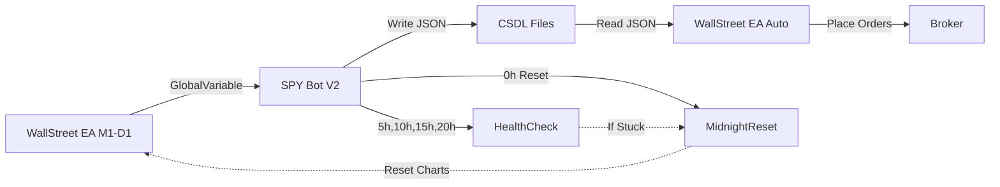

# 🤖 Multi-Trading Bot System - Architecture Guide

## 📋 MỤC LỤC

1. [Tổng quan hệ thống](#1-tổng-quan-hệ-thống)
   - 1.1 [Kiến trúc 2-Bot System](#11-kiến-trúc-2-bot-system)
   - 1.2 [LUỒNG HOẠT ĐỘNG CHÍNH](#12-luồng-hoạt-động-chính)
2. [Kiến trúc 2 Bot](#2-kiến-trúc-2-bot)
3. [Sơ đồ File & Data Flow](#3-sơ-đồ-file--data-flow)
4. [Chức năng chính - SPY Bot](#4-chức-năng-chính---spy-bot)
5. [Chức năng phụ - Reset & Health](#5-chức-năng-phụ---reset--health)
6. [Cấu trúc dữ liệu](#6-cấu-trúc-dữ-liệu)
7. [Timeline hoạt động](#7-timeline-hoạt-động)

---

## 1. TỔNG QUAN HỆ THỐNG

### 1.1 Kiến trúc 2-Bot System

```
┌──────────────────────────────────────────────────────────────┐
│                    MT4 PLATFORM (VPS)                        │
├──────────────────────────────────────────────────────────────┤
│                                                              │
│  ┌─────────────────┐         ┌─────────────────┐           │
│  │  WALLSTREET EA  │ ══════> │   SPY BOT V2    │           │
│  │   (7 charts)    │ Global  │   (Indicator)   │           │
│  │                 │ Variable│                 │           │
│  │  M1, M5, M15    │         │  Thu thập      │           │
│  │  M30, H1, H4,D1 │         │  & Phân tích   │           │
│  └─────────────────┘         └────────┬────────┘           │
│                                       │                     │
│                                       ▼                     │
│                              ┌────────────────┐             │
│                              │  CSDL FILES    │             │
│                              │  .json format  │             │
│                              └────────┬───────┘             │
│                                       │                     │
│                                       ▼                     │
│  ┌─────────────────────────────────────────────────────┐   │
│  │         7 WALLSTREET EA (Auto Trading)              │   │
│  │    M1-EA  M5-EA  M15-EA  M30-EA  H1-EA  H4-EA  D1-EA│   │
│  └─────────────────────────────────────────────────────┘   │
│                                                              │
└──────────────────────────────────────────────────────────────┘
```

**Vai trò từng thành phần:**

| Thành phần | Loại | Vai trò | Số lượng |
|------------|------|---------|----------|
| **WallStreet EA** | Expert Advisor | Phân tích & Gửi tín hiệu qua GlobalVariable | 7 EA (7 TF) |
| **SPY Bot V2** | Indicator | Thu thập tín hiệu → Phân tích → Ghi file JSON | 1 Bot (monitor 7 TF) |
| **CSDL Files** | JSON | Lưu trữ tín hiệu & phân tích | 5 files/symbol |
| **WallStreet EA (Auto)** | Expert Advisor | Đọc CSDL → Auto Trading | 7 EA (7 TF) |

---

### 1.2 LUỒNG HOẠT ĐỘNG CHÍNH

#### Sơ đồ luồng 5 STEP

```
STEP 1: WALLSTREET EA (7 TF)
   ↓  Phân tích kỹ thuật → Sinh tín hiệu
   ↓  Ghi GlobalVariable: {SYMBOL}_M1_SignalType1 = 1/-1/0
   ↓
STEP 2: SPY BOT V2 đọc GlobalVariable
   ↓
   ├─→ PHẦN 1: Xử lý TÍN HIỆU GỐC (Column 2)
   │   ├─ Đọc 14 GlobalVariables (7 TF × 2 biến)
   │   ├─ Lưu signal: -1 (SELL), 0 (NONE), 1 (BUY)
   │   ├─ Tính PriceDiff USD & TimeDiff minutes
   │   └─ Lưu vào Column 2, 3, 6, 7
   │
   └─→ PHẦN 2: Xử lý TÍN HIỆU NEWS (Column 8)
       ├─ Phân tích NEWS CASCADE patterns
       ├─ Category 1: LiveDiff threshold (L1: 2.5 USD → L7: 5.5 USD)
       ├─ Category 2: Time-based (L1: 2min → L7: 128min)
       └─ Kết quả: ±11 đến ±16 (L1-L7) hoặc 0 → Column 8
   ↓
STEP 3: GHI CSDL FILES (10 cột × 7 TF)
   ↓  LTCUSD.json (CSDL1: 10 cột + history)
   ↓  LTCUSD_LIVE.json (CSDL2: 6 cột × 3 files)
   ↓
STEP 4: WALLSTREET EA AUTO đọc CSDL Files
   ↓
   ├─→ PHẦN 1: Giao dịch theo TÍN HIỆU GỐC (đọc Column 2)
   │   ├─ S1 (HOME): Binary signal + NEWS filter
   │   │   └─ Đọc signal (Column 2) → Nếu 1: BUY, -1: SELL
   │   └─ S2 (TREND): Follow D1 trend
   │       └─ Đọc D1 signal (Column 2) → Nếu D1=1: CHỈ BUY tất cả TF
   │
   └─→ PHẦN 2: Giao dịch theo TÍN HIỆU NEWS (đọc Column 8)
       └─ S3 (NEWS): News CASCADE trading
           ├─ Đọc news (Column 8) → Nếu ±11~±16: MỞ lệnh
           └─ Bonus: Quét 7 TF, mở thêm lệnh nếu NEWS cao
   ↓
STEP 5: Gửi lệnh BUY/SELL → BROKER
```

**Tóm tắt 2 phần:**

| Bot | PHẦN 1: TÍN HIỆU GỐC | PHẦN 2: TÍN HIỆU NEWS |
|-----|---------------------|----------------------|
| **SPY Bot** | Đọc GlobalVariable → Tính PriceDiff/TimeDiff → **Column 2** (signal) | Phân tích NEWS CASCADE (L1-L7) → **Column 8** (news) |
| **EA AUTO** | **S1+S2** đọc Column 2 → Giao dịch theo signal | **S3** đọc Column 8 → Giao dịch theo news |

---

## 2. KIẾN TRÚC 2 BOT

### 2.1 WALLSTREET EA (Signal Generator)

**File:** `SUPER Spy7TF Oner V2.mq4` (Expert Advisor)

**Chức năng:**
- Phân tích kỹ thuật trên 7 timeframes
- Sinh tín hiệu BUY (+1), SELL (-1), hoặc NONE (0)
- **GHI** tín hiệu vào **GlobalVariable**

**Output GlobalVariables (14 biến/symbol):**
```cpp
// Format: {SYMBOL}_{TF}_SignalType1
LTCUSD_M1_SignalType1   = -1   // Signal: -1=SELL, 1=BUY, 0=NONE
LTCUSD_M1_LastSignalTime = 1234567890  // Timestamp

LTCUSD_M5_SignalType1   = 1
LTCUSD_M5_LastSignalTime = 1234567900

// ... 5 TF khác (M15, M30, H1, H4, D1)
```

---

### 2.2 SPY BOT V2 (Signal Collector & Analyzer)

**File:** `Super_Spy7TF_V2.mq4` (Indicator)

**Chức năng:**
1. **Thu thập:** Đọc 14 GlobalVariables mỗi 1 giây
2. **Phân tích:**
   - Tính 9 cột CSDL1 (Signal, Price, Timestamp, PriceDiff, TimeDiff, NEWS...)
   - Phát hiện NEWS CASCADE patterns (L1-L7)
   - Track history 7 entries/TF
3. **Ghi file:** 5 JSON files cho EA đọc

**Output Files:**
```
MQL4/Files/DataAutoOner/
├── LTCUSD.json           # CSDL1 - Main data (9 columns × 7 TF)
├── LTCUSD_LIVE.json      # CSDL2 File A (7 rows)
├── LTCUSD_LIVE_B.json    # CSDL2 File B (backup)
└── LTCUSD_LIVE_C.json    # CSDL2 File C (backup)
```

---

## 3. SƠ ĐỒ FILE & DATA FLOW

### 3.1 Data Flow Diagram



### 3.2 File Structure

```
Multi-Trading-Bot-Oner_2025/
│
├── MQL4/
│   ├── Indicators/
│   │   └── Super_Spy7TF_V2.mq4        ← SPY BOT (THIS FILE!)
│   │
│   ├── Experts/
│   │   └── (WallStreet EA files)       ← EA files
│   │
│   └── Files/
│       └── DataAutoOner/               ← OUTPUT FOLDER
│           ├── LTCUSD.json             ← CSDL1 Main
│           ├── LTCUSD_LIVE.json        ← CSDL2 File A
│           ├── LTCUSD_LIVE_B.json      ← CSDL2 File B
│           └── LTCUSD_LIVE_C.json      ← CSDL2 File C
│
└── README.md                            ← THIS GUIDE
```

---

## 4. CHỨC NĂNG CHÍNH - SPY BOT

### 4.1 OnInit - Khởi động

```cpp
int OnInit() {
    1. DiscoverSymbolFromChart()     // Auto detect symbol (LTCUSD, BTCUSD...)
    2. InitSymbolData()               // Khởi tạo struct 7 TF
    3. CreateFolderStructure()        // Tạo DataAutoOner/
    4. CreateEmptyCSDL1File()         // Tạo file JSON rỗng
    5. LoadCSDL1FileIntoArray()       // Load history (nếu có)
    6. EventSetTimer(1)               // Start timer 1 giây

    return INIT_SUCCEEDED;
}
```

### 4.2 OnTimer - Xử lý mỗi giây

```cpp
void OnTimer() {
    int current_second = TimeSeconds(TimeCurrent());

    // ═══════════════════════════════════════
    // PHASE 1: XỬ LÝ TÍN HIỆU (MỌI GIÂY hoặc GIÂY LẺ)
    // ═══════════════════════════════════════
    if(ProcessSignalOnOddSecond) {
        if(current_second % 2 == 1) {
            ProcessAllSignals();  // Giây lẻ: 1,3,5,7,9...
        }
    } else {
        ProcessAllSignals();      // Mọi giây: 0,1,2,3,4...
    }

    // ═══════════════════════════════════════
    // PHASE 2: CHỨC NĂNG PHỤ (GIÂY CHẴN)
    // ═══════════════════════════════════════
    if(current_second % 2 == 0) {
        UpdateLiveNEWS();                  // Update NEWS LIVE
        RunMidnightAndHealthCheck();       // 0h reset / 5h,10h,15h,20h check
        RunDashboardUpdate();              // Update dashboard
    }
}
```

### 4.3 ProcessAllSignals - Core Logic

```cpp
void ProcessAllSignals() {
    for(int i = 0; i < 7; i++) {  // 7 TF: M1, M5, M15, M30, H1, H4, D1

        // ĐỌC GlobalVariable
        string signal_var = g_target_symbol + "_" + tf_names[i] + "_SignalType1";
        string time_var = g_target_symbol + "_" + tf_names[i] + "_LastSignalTime";

        int current_signal = (int)GlobalVariableGet(signal_var);
        long current_signal_time = (long)GlobalVariableGet(time_var);

        // KIỂM TRA: Signal mới && Timestamp mới
        if(current_signal != 0 &&
           current_signal_time > g_symbol_data.processed_timestamps[i]) {

            // XỬ LÝ TÍN HIỆU MỚI
            ProcessSignalForTF(i, current_signal, current_signal_time);
        }
    }
}
```

### 4.4 ProcessSignalForTF - Xử lý 1 TF

```cpp
bool ProcessSignalForTF(int tf_idx, int signal, long signal_time) {

    // BƯỚC 1: TÍNH 9 CỘT CSDL1
    double current_price = (signal > 0) ? Ask : Bid;
    double pricediff_usd = CalculatePriceDiffUSD(...);
    int timediff_min = CalculateTimeDiffMinutes(...);
    int news_result = AnalyzeNEWS_CASCADE(...);

    // BƯỚC 2: CẬP NHẬT ARRAYS
    g_symbol_data.signals[tf_idx] = signal;
    g_symbol_data.prices[tf_idx] = current_price;
    g_symbol_data.timestamps[tf_idx] = signal_time;
    g_symbol_data.pricediffs[tf_idx] = pricediff_usd;
    g_symbol_data.timediffs[tf_idx] = timediff_min;
    g_symbol_data.news_results[tf_idx] = news_result;

    // BƯỚC 3: UPDATE HISTORY (7 entries)
    UpdateSignalHistory(tf_idx);

    // BƯỚC 4: GHI FILES
    WriteCSDL1ArrayToFile();   // LTCUSD.json
    WriteCSDL2ArrayToFile();   // LTCUSD_LIVE.json

    // BƯỚC 5: ĐÁNH DẤU ĐÃ XỬ LÝ
    g_symbol_data.processed_timestamps[tf_idx] = signal_time;

    return true;
}
```

---

## 5. CHỨC NĂNG PHỤ - RESET & HEALTH

### 5.1 MidnightReset - Reset lúc 0h:0m mỗi ngày

**Mục đích:** Reset 7 charts để tránh lỗi tích lũy

**Thời gian:** 0h:0m:0s (ĐÚNG GIỜ mỗi ngày)

**Logic:**
```cpp
void MidnightReset() {
    // Sử dụng GlobalVariable thay vì static (tránh bị reset khi OnInit)
    string gv_last_reset_time = g_target_symbol + "_LastMidnightResetTime";

    datetime last_reset = (datetime)GlobalVariableGet(gv_last_reset_time);
    datetime current_time = TimeCurrent();

    // ĐIỀU KIỆN: Ngày mới + 0h:0m + Ít nhất 1h từ lần trước
    if(TimeDay(last_reset) != TimeDay(current_time) &&
       TimeHour(current_time) == 0 &&
       TimeMinute(current_time) == 0 &&
       (current_time - last_reset) >= 3600) {

        SmartTFReset();  // Reset all 7 charts
        GlobalVariableSet(gv_last_reset_time, current_time);
    }
}
```

**Cơ chế SmartTFReset:**
1. Tìm tất cả charts của cùng symbol
2. Chuyển chart → W1 → Chờ 2s → Chuyển về TF gốc
3. Reset lần lượt: 6 charts khác trước, chart hiện tại cuối cùng
4. **KHÔNG XÓA DỮ LIỆU** - Chỉ refresh charts

---

### 5.2 HealthCheck - Kiểm tra 4 lần/ngày

**Mục đích:** Phát hiện bot bị treo → Auto reset

**Thời gian:** 5h:0m, 10h:0m, 15h:0m, 20h:0m (4 lần/ngày)

**Logic:**
```cpp
void HealthCheck() {
    // Kiểm tra file CSDL1 modification time
    string csdl1_file = DataFolder + g_target_symbol + ".json";
    datetime current_modified = (datetime)FileGetInteger(handle, FILE_MODIFY_DATE);

    // Lần đầu: Lưu timestamp
    if(g_last_csdl1_modified == 0) {
        g_last_csdl1_modified = current_modified;
        return;
    }

    // Nếu file KHÔNG thay đổi từ lần check trước
    if(current_modified == g_last_csdl1_modified) {
        Print("⚠️ HealthCheck: BOT STUCK - Auto reset triggered!");
        Alert("Bot SPY stuck - Auto reset!");
        SmartTFReset();
        g_last_csdl1_modified = TimeCurrent();
    } else {
        g_last_csdl1_modified = current_modified;
    }
}
```

**Trigger:** File không update → WallStreet EA bị lỗi → Reset charts để EA khởi động lại

---

### 5.3 RunMidnightAndHealthCheck - Điều phối

```cpp
void RunMidnightAndHealthCheck() {
    datetime current_time = TimeCurrent();
    int current_hour = TimeHour(current_time);
    int current_minute = TimeMinute(current_time);
    static int last_check_hour = -2;

    // Midnight Reset: 0h:0m
    if(EnableMidnightReset &&
       current_hour == 0 &&
       current_minute == 0 &&
       current_hour != last_check_hour) {
        MidnightReset();
        last_check_hour = current_hour;
    }

    // Health Check: 5h, 10h, 15h, 20h (ĐÚNG GIỜ)
    if(EnableHealthCheck &&
       current_minute == 0 &&
       (current_hour == 5 || current_hour == 10 ||
        current_hour == 15 || current_hour == 20) &&
       current_hour != last_check_hour) {
        HealthCheck();
        last_check_hour = current_hour;
    }
}
```

---

## 6. CẤU TRÚC DỮ LIỆU

### 6.1 Global Struct - SymbolCSDL1Data

```cpp
struct SymbolCSDL1Data {
    string symbol;                      // Symbol name (LTCUSD, BTCUSD...)

    // === 9 CỘT CSDL1 (7 TF) ===
    int signals[7];                     // Cột 3: Signal (-1, 0, 1)
    double prices[7];                   // Cột 4: Price
    long timestamps[7];                 // Cột 6: Timestamp
    double pricediffs[7];               // Cột 7: PriceDiff USD
    int timediffs[7];                   // Cột 8: TimeDiff minutes
    int news_results[7];                // Cột 9: NEWS CASCADE result

    // === TRACKING (TRÁNH TRÙNG) ===
    long processed_timestamps[7];       // Timestamp đã xử lý
    int signals_last[7];                // Signal trước đó
    double prices_last[7];              // Price trước đó

    // === HISTORY (7 TF × 7 entries) ===
    SignalHistoryEntry m1_history[7];
    SignalHistoryEntry m5_history[7];
    SignalHistoryEntry m15_history[7];
    SignalHistoryEntry m30_history[7];
    SignalHistoryEntry h1_history[7];
    SignalHistoryEntry h4_history[7];
    SignalHistoryEntry d1_history[7];

    int m1_count, m5_count, m15_count, m30_count;
    int h1_count, h4_count, d1_count;

    // === METADATA ===
    int files_written;                  // Số file đã ghi
};

SymbolCSDL1Data g_symbol_data;  // BIẾN GLOBAL DUY NHẤT
```

### 6.2 Output File Format

**CSDL1: LTCUSD.json**
```json
{
  "symbol": "LTCUSD",
  "type": "main",
  "timestamp": 1760340800,
  "rows": 7,
  "columns": 9,
  "data": [
    {
      "tf_idx": 0,
      "timeframe_name": "M1",
      "timeframe_value": 1,
      "signal": -1,
      "price": 97.85,
      "cross": 1760340720,
      "timestamp": 1760340720,
      "pricediff_usd": 0.52,
      "timediff_min": 2,
      "news": 0
    },
    // ... 6 TF khác
  ],
  "history": {
    "m1": [...],  // 7 entries
    "m5": [...],
    // ...
  }
}
```

**CSDL2: LTCUSD_LIVE.json**
```json
[
  {
    "tf_idx": 0,
    "max_loss": -889.41,
    "signal": -1,
    "timestamp": 1760340720,
    "cross": 1760340720,
    "price": 97.85,
    "pricediff_usd": 0.52,
    "timediff_min": 2,
    "news": 0
  },
  // ... 6 TF khác
]
```

---

## 7. TIMELINE HOẠT ĐỘNG

### 7.1 Timeline trong 1 ngày

```
00:00:00 → MidnightReset (reset 7 charts)
00:00:02 → OnTimer tiếp tục hoạt động bình thường

05:00:00 → HealthCheck (kiểm tra file CSDL1)
10:00:00 → HealthCheck
15:00:00 → HealthCheck
20:00:00 → HealthCheck

Mỗi giây → ProcessAllSignals() (nếu có tín hiệu mới)
```

### 7.2 Khi có tín hiệu mới (VD: M5 SELL)

```
T+0ms:   WallStreet EA (M5) phát hiện pattern → Ghi GlobalVariable
T+1000ms: SPY Bot đọc GlobalVariable → Phát hiện tín hiệu mới
T+1050ms: ProcessSignalForTF(M5, -1, timestamp)
T+1100ms: Tính 9 cột CSDL1
T+1150ms: Phân tích NEWS CASCADE
T+1200ms: Ghi LTCUSD.json
T+1250ms: Ghi LTCUSD_LIVE.json
T+1300ms: WallStreet EA (Auto) đọc file → Place SELL order
```

### 7.3 Khi bot bị treo (Detected by HealthCheck)

```
10:00:00 → HealthCheck() chạy
10:00:01 → Phát hiện: File KHÔNG thay đổi từ 5h trước
10:00:02 → Alert("Bot SPY stuck - Auto reset!")
10:00:03 → SmartTFReset() → Reset 7 charts
10:00:15 → WallStreet EA khởi động lại
10:00:20 → SPY Bot bắt đầu nhận tín hiệu lại
```

---

## 🎯 TÓM TẮT CHO NEWCHAT MỚI

```
HỆ THỐNG 2-BOT:
├─ WallStreet EA (7 EA) → Phân tích → Ghi GlobalVariable
└─ SPY Bot V2 (1 Indicator) → Đọc GV → Phân tích 2 phần → Ghi JSON
    ├─ PHẦN 1: Tín hiệu gốc (Column 2: signal)
    └─ PHẦN 2: Tín hiệu NEWS (Column 8: news)

LUỒNG DỮ LIỆU:
WallStreet EA → GlobalVariable → SPY Bot (2 phần) → JSON
→ EA Auto (S1+S2 đọc Column 2, S3 đọc Column 8) → Broker

CHỨC NĂNG CHÍNH:
✅ Thu thập 14 GlobalVariables mỗi giây (7 TF × 2 biến)
✅ Xử lý & Tính 9 cột CSDL1 + NEWS CASCADE
✅ Ghi 5 files JSON cho EA đọc

CHỨC NĂNG PHỤ:
✅ MidnightReset: 0h:0m mỗi ngày (reset charts)
✅ HealthCheck: 5h,10h,15h,20h (phát hiện stuck)
✅ Dashboard: Hiển thị trạng thái real-time

ĐIỂM MẠNH:
🚀 2 phần xử lý rõ ràng: Tín hiệu gốc + NEWS CASCADE
🚀 Tự động nhận diện symbol
🚀 Xử lý 7 TF song song, không trùng lặp
🚀 Có recovery mechanism (reset when stuck)
🚀 Code đơn giản, không dùng class phức tạp
```

---

## 📌 LƯU Ý QUAN TRỌNG

1. **File quan trọng nhất:** `Super_Spy7TF_V2.mq4` (SPY Bot Indicator)
2. **Output folder:** `MQL4/Files/DataAutoOner/`
3. **Input parameters:**
   - `EnableMidnightReset = true` (reset mỗi ngày)
   - `EnableHealthCheck = true` (check 4 lần/ngày)
4. **GlobalVariables:** F3 → Terminal → Global Variables → Xem 14 biến
5. **Logs:** Experts tab → Tìm "SPY" để xem hoạt động

---

**📅 Last Updated:** 2025-11-03
**🔄 Latest Changes:**
- **Bổ sung 1.2: LUỒNG HOẠT ĐỘNG CHÍNH** - Sơ đồ 5 STEP chi tiết + 2 phần SPY + 2 phần EA
- Removed StartupReset (không cần thiết)
- Optimized HealthCheck: 8h,16h → 5h,10h,15h,20h
- Added current_minute check for precise timing

**✅ Status:** Production Ready - Tested with LTCUSD, BTCUSD
