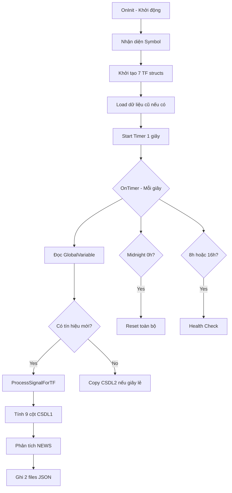

# 📚 MASTER GUIDE - SUPER_Spy7TF_Oner_V2
## 🎯 HƯỚNG DẪN TOÀN DIỆN CHO NEWCHAT MỚI

---

## 🏗️ **PHẦN 1: KIẾN TRÚC TỔNG QUAN**

### **1.1 MỤC ĐÍCH CỐT LÕI**

```
BOT SPY V2 = Signal Collector + Data Writer
├─ THU THẬP: 2 tín hiệu gốc từ WallStreet Bot
├─ XỬ LÝ: 7 timeframes độc lập, không trùng lặp
├─ PHÂN TÍCH: NEWS CASCADE + biến động
└─ GHI FILE: 2 JSON files cho EA đọc
```

### **1.2 LUỒNG HOẠT ĐỘNG CHÍNH**



---

## 📂 **PHẦN 2: CẤU TRÚC DỮ LIỆU QUAN TRỌNG**

### **2.1 BIẾN TÍN HIỆU GỐC (QUAN TRỌNG NHẤT!)**

```cpp
// 🔴 ĐÂY LÀ 2 BIẾN QUAN TRỌNG NHẤT - TÍN HIỆU GỐC TỪ WALLSTREET BOT
// Mỗi TF có 1 cặp biến riêng, format chuẩn:

string signal_var = "LTCUSD_M1_SignalType1";      // Biến #1: Tín hiệu (1=BUY, -1=SELL)
string time_var = "LTCUSD_M1_LastSignalTime";     // Biến #2: Timestamp

// BOT SPY đọc 7 cặp biến này mỗi giây:
LTCUSD_M1_SignalType1  + LTCUSD_M1_LastSignalTime
LTCUSD_M5_SignalType1  + LTCUSD_M5_LastSignalTime
LTCUSD_M15_SignalType1 + LTCUSD_M15_LastSignalTime
LTCUSD_M30_SignalType1 + LTCUSD_M30_LastSignalTime
LTCUSD_H1_SignalType1  + LTCUSD_H1_LastSignalTime
LTCUSD_H4_SignalType1  + LTCUSD_H4_LastSignalTime
LTCUSD_D1_SignalType1  + LTCUSD_D1_LastSignalTime
```

### **2.2 CẤU TRÚC DỮ LIỆU CHÍNH**

```cpp
// GLOBAL STRUCT - 1 STRUCT CHO TOÀN BỘ SYMBOL
struct SymbolCSDL1Data {
    string symbol;                    // Symbol hiện tại
    
    // 7 TF × 9 cột CSDL1 (dữ liệu hiện tại)
    int signals[7];                   // Cột 3: Signal
    double prices[7];                 // Cột 4: Price
    long timestamps[7];               // Cột 6: Timestamp
    double pricediffs[7];             // Cột 7: PriceDiff USD
    int timediffs[7];                 // Cột 8: TimeDiff minutes
    int news_results[7];              // Cột 9: NEWS CASCADE
    
    // Tracking variables (QUAN TRỌNG - TRÁNH TRÙNG TÍN HIỆU)
    long processed_timestamps[7];     // Timestamp đã xử lý
    int signals_last[7];              // Signal trước đó
    double prices_last[7];            // Price trước đó
    
    // History arrays (7 TF × 7 entries)
    SignalHistoryEntry m1_history[7];
    // ... các TF khác
    
    // Metadata
    int files_written;                // Đếm số file đã ghi
};

SymbolCSDL1Data g_symbol_data;       // BIẾN GLOBAL DUY NHẤT
```

---

## ⚙️ **PHẦN 3: CÁC CHỨC NĂNG CHÍNH**

### **3.1 CHỨC NĂNG TỰ ĐỘNG NHẬN DIỆN (⭐⭐⭐⭐⭐)**

```cpp
// FUNCTION: DiscoverSymbolFromChart()
// MỤC ĐÍCH: Tự động nhận diện symbol từ chart hiện tại
// VÌ SAO QUAN TRỌNG: Không cần config, attach vào chart nào cũng chạy

string DiscoverSymbolFromChart() {
    if(StringLen(TargetSymbol) > 0) return TargetSymbol;  // Ưu tiên input
    string chart_symbol = Symbol();                        // Lấy từ chart
    if(StringLen(chart_symbol) > 0) return chart_symbol;
    return "EURUSD";                                       // Fallback
}
```

### **3.2 CHỨC NĂNG XỬ LÝ TÍN HIỆU (⭐⭐⭐⭐⭐)**

```cpp
// FUNCTION: ProcessSignalForTF()
// MỤC ĐÍCH: Xử lý tín hiệu cho 1 TF cụ thể
// VÌ SAO QUAN TRỌNG: Đây là core logic, tránh trùng tín hiệu

bool ProcessSignalForTF(int tf_idx, int signal, long signal_time) {
    // BƯỚC 1: KIỂM TRA TRÙNG (QUAN TRỌNG!)
    if(signal_time <= g_symbol_data.processed_timestamps[tf_idx]) {
        return false;  // Đã xử lý rồi, bỏ qua
    }
    
    // BƯỚC 2: TÍNH 9 CỘT CSDL1
    double current_price = (signal > 0) ? Ask : Bid;
    double pricediff_usd = CalculatePriceDiff(...);
    int timediff_min = CalculateTimeDiff(...);
    int news_result = AnalyzeNEWS();
    
    // BƯỚC 3: CẬP NHẬT ARRAYS
    g_symbol_data.signals[tf_idx] = signal;
    g_symbol_data.prices[tf_idx] = current_price;
    g_symbol_data.timestamps[tf_idx] = signal_time;
    g_symbol_data.pricediffs[tf_idx] = pricediff_usd;
    g_symbol_data.timediffs[tf_idx] = timediff_min;
    g_symbol_data.news_results[tf_idx] = news_result;
    
    // BƯỚC 4: ĐÁNH DẤU ĐÃ XỬ LÝ (QUAN TRỌNG!)
    g_symbol_data.processed_timestamps[tf_idx] = signal_time;
    
    // BƯỚC 5: GHI FILES
    WriteCSDL1ArrayToFile();   // File 1: LTCUSD.json
    WriteCSDL2ArrayToFile();   // File 2: LTCUSD_LIVE.json
    
    return true;
}
```

### **3.3 CHỨC NĂNG NEWS CASCADE (⭐⭐⭐⭐)**

```cpp
// FUNCTION: DetectCASCADE_New()
// MỤC ĐÍCH: Phát hiện pattern cascade qua nhiều TF
// VÌ SAO QUAN TRỌNG: Tín hiệu mạnh khi nhiều TF cùng hướng

int DetectCASCADE_New() {
    // 6 LEVELS CASCADE:
    // L1: M5→M1     (basic +1,  advanced +16)
    // L2: M15→M5→M1 (basic +12, advanced +17)
    // L3: M30→M15→M5 (basic +13, advanced +18)
    // L4: H1→M30→M15 (basic +14, advanced +19)
    // L5: H4→H1→M30 (basic +15, advanced +20)
    // L6: D1→H4→H1  (basic +16, advanced +30)
    
    // Logic: Kiểm tra cross reference
    if(m5_signal == m1_signal && m5_cross == m1_timestamp) {
        return 1;  // L1 detected
    }
    // ... kiểm tra các level khác
}
```

### **3.4 CHỨC NĂNG HEALTH CHECK (⭐⭐⭐)**

```cpp
// FUNCTION: HealthCheck()
// THỜI GIAN: 8h và 16h mỗi ngày
// MỤC ĐÍCH: Kiểm tra bot có bị treo không

void HealthCheck() {
    // Kiểm tra file CSDL1 có thay đổi không
    datetime current_modified = FileGetModifyTime(...);
    
    if(current_modified == g_last_csdl1_modified) {
        Print("⚠️ BOT STUCK - Triggering reset!");
        SmartTFReset();  // Reset tất cả charts
    }
}
```

### **3.5 CHỨC NĂNG MIDNIGHT RESET (⭐⭐⭐)**

```cpp
// FUNCTION: MidnightReset()
// THỜI GIAN: 0h mỗi ngày
// MỤC ĐÍCH: Reset để tránh lỗi tích lũy

void MidnightReset() {
    if(TimeHour(TimeCurrent()) == 0) {
        SmartTFReset();  // Reset all 7 TF charts
        // Giữ nguyên data, chỉ reset chart
    }
}
```

---

## 🔄 **PHẦN 4: LUỒNG XỬ LÝ CHI TIẾT**

### **4.1 LUỒNG KHỞI ĐỘNG (OnInit)**

```
1. DiscoverSymbolFromChart()      → Nhận diện symbol
2. InitSymbolData()                → Khởi tạo struct
3. CreateFolderStructure()         → Tạo 3 folders
4. CreateEmptyCSDL1File()          → Tạo file rỗng
5. CreateEmptyCSDL2Files()         → Tạo 3 files LIVE
6. LoadCSDL1FileIntoArray()        → Load data cũ
7. EventSetTimer(1)                → Start timer 1 giây
```

### **4.2 LUỒNG MỖI GIÂY (OnTimer)**

```
MỖI 1 GIÂY:
├─ PHASE 0: Health Check (nếu 8h/16h) hoặc Reset (nếu 0h)
│
├─ PHASE 1: Xử lý 7 TF song song
│   └─ FOR each TF (M1, M5, M15, M30, H1, H4, D1):
│       ├─ Đọc GlobalVariable (signal + time)
│       ├─ Kiểm tra: signal != 0 && time > processed_time
│       └─ Gọi ProcessSignalForTF() nếu có tín hiệu mới
│
├─ PHASE 2: Copy CSDL2 (giây lẻ)
│   └─ Copy file A → B, C nếu có tín hiệu mới
│
└─ PHASE 3: Update Dashboard (10 giây/lần)
```

---

## 📝 **PHẦN 5: FILES OUTPUT**

### **5.1 FILE CSDL1: LTCUSD.json**

```json
{
  "symbol": "LTCUSD",
  "type": "main",
  "timestamp": 1760340800,
  "rows": 7,
  "columns": 9,
  "data": [
    {"timeframe_name": "M1", "signal": -1, "price": 97.85, ...},
    {"timeframe_name": "M5", "signal": 1, "price": 98.91, ...},
    // ... 5 TF khác
  ],
  "history": {
    "m1": [...],  // 7 entries
    "m5": [...],  // 7 entries
    // ...
  }
}
```

### **5.2 FILE CSDL2: LTCUSD_LIVE.json**

```json
[
  {"max_loss": -889.41, "timestamp": 1760340720, "signal": -1, ...},
  {"max_loss": -889.41, "timestamp": 1760340000, "signal": 1, ...},
  // ... 5 TF khác
]
```

---

## 🚨 **PHẦN 6: ĐIỂM QUAN TRỌNG CẦN NHỚ**

### **6.1 VÌ SAO CODE NÀY TỐT?**

1. **ĐƠN GIẢN**: Không dùng class phức tạp
2. **ROBUST**: Có health check, midnight reset
3. **KHÔNG TRÙNG**: Mỗi TF có processed_timestamps riêng
4. **TỰ ĐỘNG**: Nhận diện symbol/TF tự động
5. **REAL-TIME**: Xử lý mỗi giây, không miss tín hiệu

### **6.2 SAI LẦM THƯỜNG GẶP**

```cpp
// ❌ SAI: Gán baseline nhiều lần
g_signal_old = new_signal;     // Chỉ gán 1 lần trong OnInit

// ❌ SAI: Không check processed_timestamps
if(signal != 0) Process();     // Sẽ xử lý trùng

// ✅ ĐÚNG: Check timestamp trước
if(signal != 0 && time > processed_timestamps[i]) Process();
```

### **6.3 DEBUG TIPS**

```cpp
// Bật Debug để xem chi tiết
input bool Debug = true;

// Check GlobalVariables
F3 → Terminal → Global Variables → Xem 14 biến

// Check files
MQL4/Files/DataAutoOner/LTCUSD.json
```

---

## 📋 **PHẦN 7: KẾ HOẠCH CHO NEWCHAT MỚI**

### **7.1 CHUẨN BỊ**

```markdown
1. ĐỌC FILES THEO THỨ TỰ:
   ├─ SUPER_Spy7TF_Oner_V2.mq4 (code chính)
   ├─ LTCUSD.json (output mẫu)
   ├─ LTCUSD_HOME.json (CSDL2 mẫu)
   └─ Master Guide này

2. HIỂU CẤU TRÚC:
   ├─ 2 tín hiệu gốc từ GlobalVariable
   ├─ 7 TF xử lý độc lập
   ├─ 9 cột CSDL1 + NEWS analysis
   └─ 2 files output JSON

3. NẮM LUỒNG:
   OnInit → OnTimer (1s) → ProcessSignalForTF → Write Files
```

### **7.2 NHIỆM VỤ TIẾP THEO**

```markdown
OPTION A: TỐI ƯU CODE
├─ Giảm từ 2700 → 2000 lines
├─ Tách NEWS thành module riêng
└─ Thêm multi-symbol support

OPTION B: THÊM CHỨC NĂNG
├─ Telegram notification
├─ Email alert khi cascade L4+
└─ Dashboard graphic

OPTION C: MERGE VỚI EA
├─ Tích hợp SPY vào EA
├─ Giảm delay đọc file
└─ Trade trực tiếp từ signal
```

---

## 🎯 **TÓM TẮT NGẮN GỌN CHO NEWCHAT**

```
BOT SPY V2 = WallStreet Signal Reader + JSON Writer

INPUT:  14 GlobalVariables (7 TF × 2 biến)
PROCESS: Mỗi giây check → Có signal mới → Process → Write
OUTPUT: 2 JSON files cho EA đọc

QUAN TRỌNG:
1. Tránh trùng signal: dùng processed_timestamps[7]
2. Health check: 8h, 16h reset nếu stuck
3. Midnight reset: 0h daily
4. NEWS CASCADE: 6 levels (L1-L6)

ƯU ĐIỂM:
✅ Code đơn giản (không class)
✅ Tự động nhận diện symbol
✅ Xử lý 7 TF độc lập
✅ Có recovery & health check
```
**📌 LƯU Ý CUỐI:**

Code SUPER_Spy7TF_Oner_V2 là **BEST VERSION** hiện tại. Nên dùng làm base cho mọi phát triển tiếp theo. Đã test production với nhiều symbol và ổn định.
